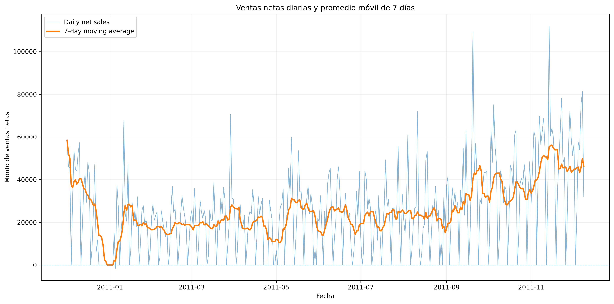
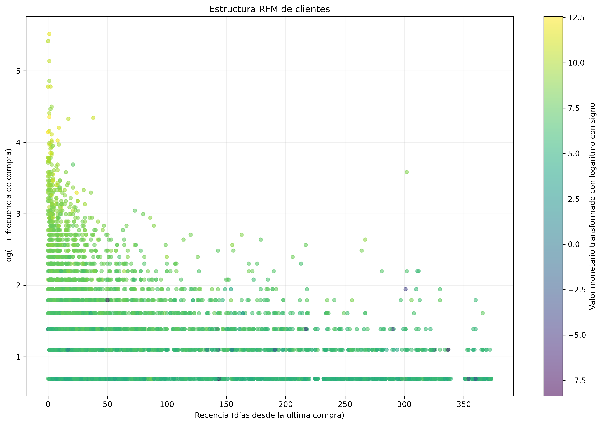
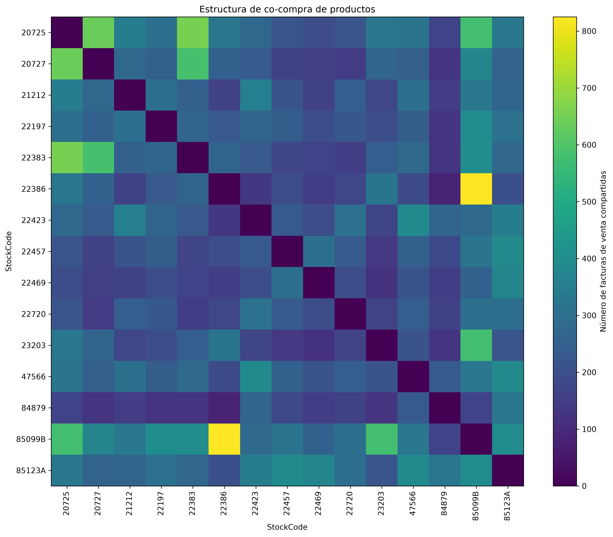
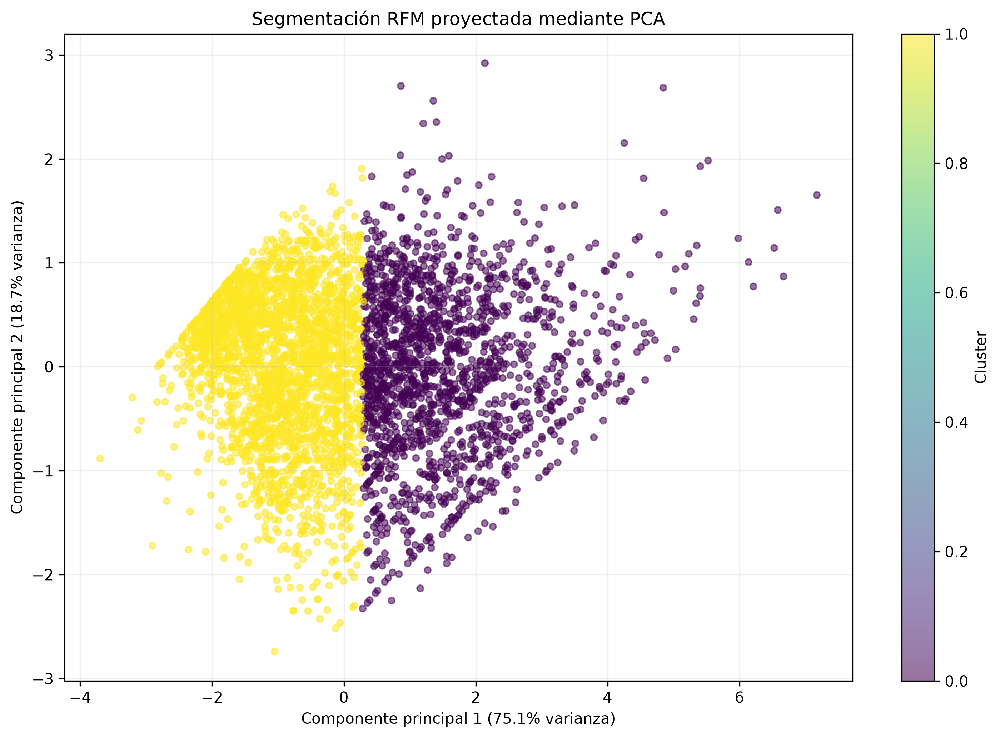
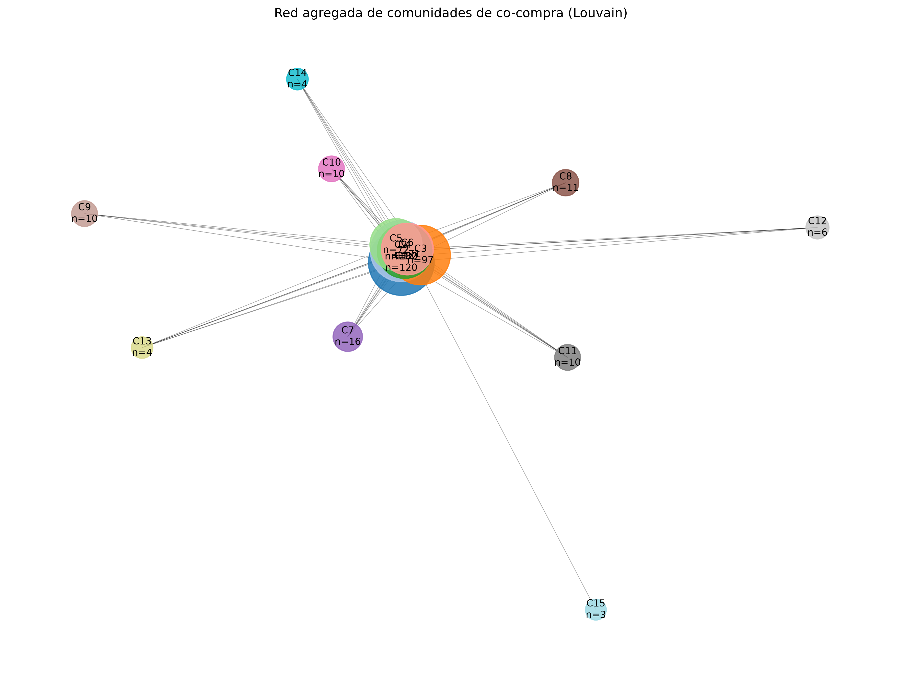
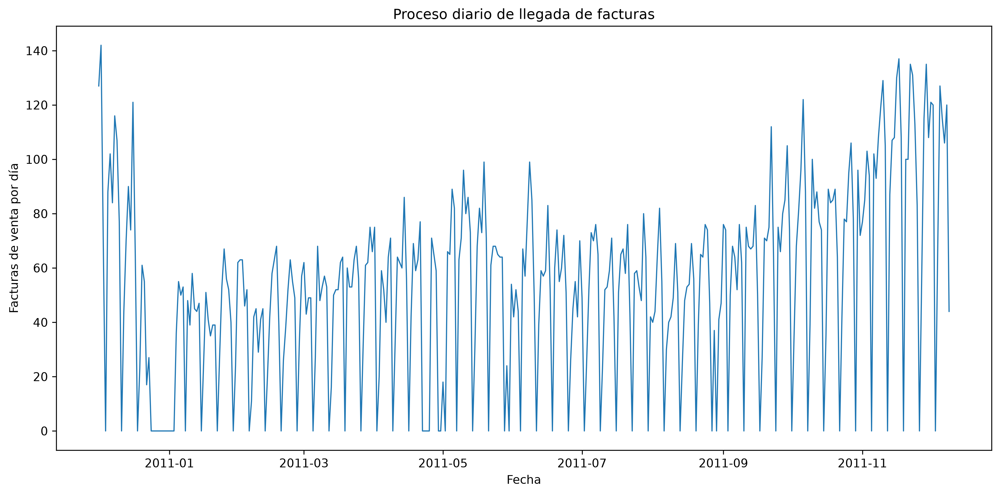
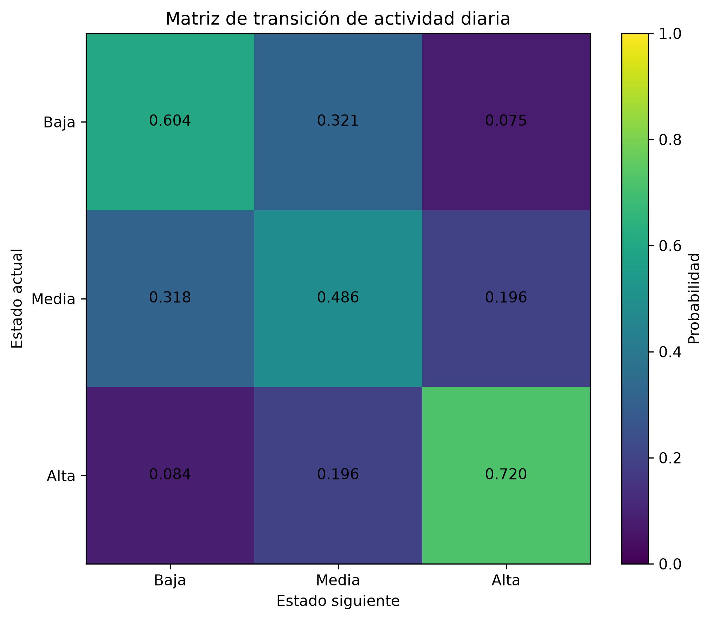
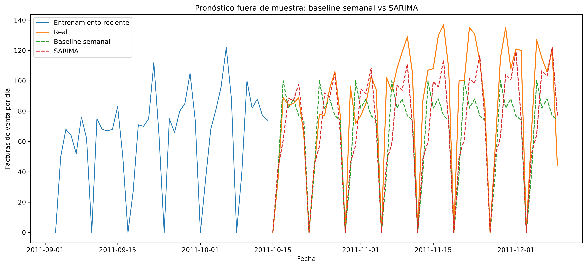

# Taller 1 — Adquisición, procesamiento y visualización de datos

**Maestría en Ciencia de Datos — Yachay Tech**  
**Asignatura:** Fundamentos de Ciencia de Datos

## Descripción

Este proyecto desarrolla un flujo reproducible para la adquisición, limpieza, almacenamiento, análisis exploratorio y visualización del conjunto de datos **Online Retail** del UCI Machine Learning Repository.

El proceso implementado sigue cuatro etapas principales:

1. limpieza y preparación de los datos;
2. almacenamiento en SQLite;
3. análisis exploratorio de datos;
4. generación de visualizaciones e interpretación.

Los scripts fueron diseñados para que cada etapa pueda ejecutarse nuevamente desde la terminal y valide automáticamente sus resultados.

---

<!-- HOMEWORK1-SUMMARY:START -->


## Resumen ejecutivo

Este trabajo desarrolla un flujo completo y reproducible de ciencia de datos utilizando el conjunto **Online Retail**.

El objetivo principal es cubrir tres etapas:

1. adquisición y procesamiento de datos;
2. análisis exploratorio mediante SQLite y pandas;
3. visualización e interpretación de resultados.

Adicionalmente, el trabajo incorpora extensiones de:

- RFM;
- K-Means;
- PCA;
- teoría de grafos;
- procesos estocásticos;
- Markov;
- series temporales;
- SARIMA.

La idea no es utilizar muchos algoritmos por cantidad, sino hacer que cada método responda una pregunta distinta.

### Flujo conceptual

```text
datos originales
      ↓
auditoría y limpieza
      ↓
SQLite
      ↓
EDA y visualización
      ↓
RFM + K-Means + PCA
      ↓
grafo de co-compra
      ↓
proceso de llegadas
      ↓
Markov
      ↓
SARIMA
```

Cada etapa responde una pregunta distinta:

- **limpieza:** ¿qué datos pueden analizarse de forma consistente?
- **EDA:** ¿qué estructura general presenta el conjunto?
- **RFM:** ¿cómo se diferencian los clientes?
- **grafos:** ¿qué productos aparecen relacionados mediante co-compra?
- **proceso de llegadas:** ¿cómo se distribuye temporalmente la actividad?
- **Markov:** ¿existe persistencia entre niveles de actividad?
- **SARIMA:** ¿la estructura temporal permite mejorar un pronóstico de referencia?

## Arquitectura de scripts

| Script | Entrada | Función principal | Salida | Concepto clave |
|---|---|---|---|---|
| `src/01_load_clean.py` | Excel original | audita, limpia, clasifica y enriquece registros | CSV procesado | limpieza conservadora y validación |
| `src/02_create_database.py` | CSV procesado | almacena los datos y crea índices | base SQLite | persistencia y consultas eficientes |
| `src/03_eda.py` | SQLite | reconstruye el DataFrame, valida y resume los datos | reporte EDA | análisis exploratorio |
| `src/04_visualizations.py` | SQLite | agrega información y genera figuras | visualizaciones | interpretación gráfica |
| `src/05_rfm_clustering.py` | ventas con CustomerID | construye RFM, aplica log1p, estandariza, K-Means y PCA | clusters de clientes | segmentación no supervisada |
| `src/06_product_graph.py` | facturas de venta | construye matriz factura-producto y co-ocurrencias | grafo de productos | teoría de grafos |
| `src/stochastic/arrival_process.py` | facturas de venta | construye la serie diaria de llegadas | serie temporal | proceso de conteo |
| `src/stochastic/distributions.py` | serie de llegadas | estudia dispersión y estructura probabilística | diagnósticos | Poisson y sobredispersión |
| `src/stochastic/markov_analysis.py` | estados Low, Medium y High | estima probabilidades de transición | matriz de transición | persistencia de estados |
| `src/stochastic/time_series.py` | serie temporal diaria | compara baseline semanal y SARIMA | pronóstico fuera de muestra | estacionalidad y predicción |

---

## Parte 1 — Adquisición y limpieza

El conjunto original contiene:

- **541,909 registros**;
- **8 variables originales**.

Durante la auditoría se encontraron:

- 5,268 duplicados exactos;
- cancelaciones;
- cantidades negativas;
- precios iguales o inferiores a cero;
- clientes sin identificador.

La decisión metodológica principal fue **no eliminar automáticamente todo valor atípico**.

Se eliminaron únicamente los duplicados exactos. Las cancelaciones, devoluciones, ajustes y clientes no identificados se conservaron porque pueden representar operaciones comerciales reales.

El conjunto procesado contiene:

- **536,641 registros**;
- **22 columnas**.

---

## Parte 2 — Base de datos SQLite

Los datos procesados se almacenaron en:

`database/online_retail.db`

La tabla principal es:

`transactions`

SQLite permite separar claramente:

**procesamiento → almacenamiento → consulta → análisis**

---

## Parte 3 — Análisis exploratorio

Los principales resultados del EDA fueron:

- aproximadamente **25,900 facturas**;
- **4,070 productos**;
- **4,372 clientes identificados**;
- **38 países**;
- **305 días con actividad**.

Reino Unido concentra aproximadamente:

**91.36% de las transacciones.**

Esto significa que los resultados no deben generalizarse automáticamente a todos los mercados internacionales.

---

## Visualizaciones principales del Taller 1

### Figura 1 — Ventas netas diarias

Esta visualización permite observar la evolución temporal de la actividad comercial.



---

### Figura 2 — Estructura RFM de clientes

Permite observar diferencias entre clientes en recencia, frecuencia y valor monetario.



---

### Figura 3 — Co-compra de productos

Permite observar relaciones entre productos que aparecen conjuntamente en las facturas.



---

## Extensiones avanzadas

### 1. Segmentación RFM, K-Means y PCA

Se analizaron:

- **4,338 clientes**.

El mejor resultado de clustering fue:

- **K = 2**;
- **Silhouette Score ≈ 0.4325**.

Uno de los grupos contiene clientes más recientes, frecuentes y de mayor valor monetario.

Los dos primeros componentes de PCA explican aproximadamente:

**93.86% de la variabilidad** de las variables RFM transformadas.



---

### 2. Grafo de co-compra

En este grafo:

- cada nodo representa un producto;
- cada arista representa una relación de co-compra.

El grafo final contiene:

- **729 nodos**;
- **8,061 aristas**;
- **15 comunidades Louvain**.

Esto permite identificar productos centrales y grupos de productos que aparecen frecuentemente juntos.



---

### 3. Proceso de llegadas

Se analizaron:

- **19,960 facturas de venta**;
- **374 días calendario**.

La media diaria es aproximadamente:

**53.37 facturas**

y el índice de dispersión global es:

**21.90**

Como este valor es muy superior a 1, existe una sobredispersión fuerte.

Además:

**autocorrelación en lag 7 ≈ 0.795**

lo que revela una estructura semanal muy marcada.



---

### 4. Modelo de Markov

La actividad se clasificó en tres estados:

- Low;
- Medium;
- High.

Las probabilidades más importantes son:

- **P(Low → Low) ≈ 60.4%**;
- **P(High → High) ≈ 72.0%**.

La persistencia global es aproximadamente:

**60.3%**

Esto muestra que los estados de actividad presentan persistencia temporal.



---

### 5. Pronóstico SARIMA

El modelo seleccionado fue:

**SARIMA(1,0,1)(1,1,1,7)**

Se comparó con un baseline semanal utilizando las últimas ocho semanas como conjunto de prueba.

#### Baseline

- MAE = **22.39**;
- RMSE = **29.59**;
- sMAPE = **30.43%**.

#### SARIMA

- MAE = **18.40**;
- RMSE = **25.41**;
- sMAPE = **25.53%**.

La mejora fue aproximadamente:

- **17.85% en MAE**;
- **14.11% en RMSE**.



La prueba de Ljung-Box indica que todavía queda autocorrelación en los residuos.

Por tanto, SARIMA mejora el pronóstico, pero no captura toda la dinámica temporal.

---

## Conclusiones del Taller 1

1. La limpieza debe considerar el significado comercial de las observaciones y no limitarse a eliminar valores aparentemente anómalos.

2. SQLite permite construir un flujo reproducible que separa procesamiento, almacenamiento y análisis.

3. El conjunto está fuertemente concentrado en Reino Unido, por lo que la generalización geográfica debe realizarse con cautela.

4. RFM y K-Means muestran diferencias importantes entre clientes en recencia, frecuencia y valor monetario.

5. La red de co-compra demuestra que existen relaciones estructuradas entre productos y comunidades comercialmente coherentes.

6. La actividad diaria presenta fuerte sobredispersión y una estacionalidad semanal claramente observable.

7. El modelo de Markov muestra persistencia entre niveles de actividad, especialmente en el estado High.

8. SARIMA aprovecha parte de la estructura temporal y mejora el pronóstico frente a un baseline semanal sencillo.

9. Los residuos del modelo todavía contienen autocorrelación, por lo que existe margen para modelos temporales más ricos.

---

## Documentación técnica detallada

**Limpieza** → ¿qué datos puedo analizar?

**SQLite** → ¿cómo almaceno los datos?

**EDA** → ¿qué está ocurriendo?

**RFM / K-Means** → ¿cómo se comportan los clientes?

**Grafos** → ¿qué productos se compran juntos?

**Procesos estocásticos** → ¿cómo llegan las compras?

**Markov** → ¿persisten los estados de actividad?

**SARIMA** → ¿podemos anticipar la actividad futura?

<!-- HOMEWORK1-SUMMARY:END -->

### Conjunto de datos

El conjunto original corresponde a transacciones de una empresa minorista en línea entre diciembre de 2010 y diciembre de 2011.

Variables originales principales:

- `InvoiceNo`: número de factura;
- `StockCode`: código del producto;
- `Description`: descripción del producto;
- `Quantity`: cantidad;
- `InvoiceDate`: fecha y hora de la transacción;
- `UnitPrice`: precio unitario;
- `CustomerID`: identificador del cliente;
- `Country`: país.

El archivo original contiene:

- 541,909 registros;
- 8 columnas;
- 5,268 registros exactamente duplicados.

---

### Estructura del proyecto

    Taller 1/
    ├── data/
    │   ├── raw/
    │   └── processed/
    ├── database/
    ├── figures/
    │   ├── 01_daily_sales.png
    │   ├── 02_rfm_customers.png
    │   └── 03_product_cooccurrence.png
    ├── reports/
    │   ├── eda_report.txt
    │   └── visualizations_report.txt
    ├── src/
    │   ├── 01_load_clean.py
    │   ├── 02_create_database.py
    │   ├── 03_eda.py
    │   ├── 04_visualizations.py
    │   └── stochastic/
    ├── requirements.txt
    ├── .gitignore
    └── README.md

Los datos procesados y la base SQLite pueden regenerarse mediante los scripts del proyecto.

---

### Preparación del entorno

Se utilizó Python 3.13 dentro de un entorno virtual.

Crear el entorno:

    python -m venv .venv

Activarlo en PowerShell:

    .venv\Scripts\Activate.ps1

Instalar las dependencias:

    pip install -r requirements.txt

---

### 1. Limpieza y preparación

Ejecutar:

    python src/01_load_clean.py

El script:

- carga el archivo original;
- realiza una auditoría de calidad;
- elimina duplicados exactos;
- conserva cancelaciones y ajustes;
- identifica cantidades y precios anómalos;
- conserva registros sin `CustomerID`;
- genera variables auxiliares;
- calcula `TotalAmount = Quantity * UnitPrice`;
- genera variables temporales;
- clasifica las transacciones.

Después de eliminar duplicados exactos se obtienen:

- 536,641 registros;
- 22 columnas.

Tipos de transacción:

- Sale: 524,878;
- Cancellation: 9,251;
- Adjustment: 1,336;
- Other: 1,176.

El archivo procesado se genera en:

    data/processed/online_retail_clean.csv

---

### 2. Base de datos SQLite

Ejecutar:

    python src/02_create_database.py

El script carga los datos procesados en:

    database/online_retail.db

La tabla principal se denomina:

    transactions

Se crean índices sobre:

- `InvoiceNo`;
- `InvoiceDate`;
- `CustomerID`;
- `Country`;
- `TransactionType`.

La validación final comprueba que la base contenga los mismos 536,641 registros del conjunto procesado.

---

### 3. Análisis exploratorio de datos

Ejecutar:

    python src/03_eda.py

El análisis se realiza leyendo directamente desde SQLite y transformando la tabla nuevamente en un `DataFrame` de pandas.

Se estudian:

- dimensiones del conjunto;
- tipos de datos;
- valores faltantes;
- valores únicos;
- estadísticas descriptivas;
- estructura de las transacciones;
- distribución geográfica;
- comportamiento temporal;
- metadatos de cada variable.

Resultados generales:

- 25,900 facturas;
- 4,070 productos;
- 4,372 clientes identificados;
- 38 países;
- 305 días con actividad.

El reporte completo se genera en:

    reports/eda_report.txt

---

### 4. Visualización de datos

Ejecutar:

    python src/04_visualizations.py

El script genera tres visualizaciones principales.

#### Figura 1 — Ventas netas diarias

Archivo:

    figures/01_daily_sales.png


Presenta las ventas netas por día junto con un promedio móvil de siete días.

Permite observar:

- variabilidad diaria;
- tendencia temporal;
- patrones semanales;
- días sin actividad.

#### Figura 2 — Estructura RFM de clientes

Archivo:

    figures/02_rfm_customers.png


Representa conjuntamente:

- recencia;
- frecuencia;
- valor monetario.

Las transformaciones logarítmicas permiten visualizar mejor la fuerte asimetría existente entre clientes.

Esta estructura constituye una base para posteriores técnicas de segmentación.

#### Figura 3 — Co-compra de productos

Archivo:

    figures/03_product_cooccurrence.png


Se construye una matriz de coocurrencia para los productos más frecuentes.

La visualización permite estudiar qué productos aparecen repetidamente dentro de las mismas facturas y constituye una base para:

- análisis de cesta de mercado;
- sistemas de recomendación;
- teoría de grafos;
- detección de comunidades.

El análisis textual de las figuras se genera en:

    reports/visualizations_report.txt

---

### Ejecución completa

Con el archivo original disponible, el flujo completo puede reproducirse ejecutando:

    python src/01_load_clean.py
    python src/02_create_database.py
    python src/03_eda.py
    python src/04_visualizations.py

Cada etapa incorpora validaciones antes de finalizar.

---

### Decisiones metodológicas

La limpieza se diseñó para evitar eliminar información potencialmente válida.

Por esta razón, no se consideran automáticamente errores:

- cantidades negativas;
- precios iguales a cero;
- cancelaciones;
- ajustes administrativos;
- registros sin identificador de cliente.

En lugar de eliminarlos, estos casos se identifican y clasifican para poder decidir posteriormente qué observaciones deben utilizarse según el objetivo específico del análisis.

---

### Reproducibilidad

El proyecto utiliza Git para mantener cada etapa separada y trazable.

El flujo implementado es:

    datos originales
          ↓
    limpieza
          ↓
    datos procesados
          ↓
    SQLite
          ↓
    análisis exploratorio
          ↓
    visualizaciones
          ↓
    reportes

Los archivos derivados pueden regenerarse a partir de los scripts incluidos.

---

### Extensiones avanzadas — implementadas y validadas

Las extensiones avanzadas ya forman parte del proyecto. Su propósito es ampliar el análisis base y responder preguntas distintas sobre clientes, productos y comportamiento temporal.

La secuencia conceptual es:

    datos limpios
          ↓
    clientes
          ↓
    productos
          ↓
    llegadas en el tiempo
          ↓
    estados de actividad
          ↓
    pronóstico

La idea central no es aplicar algoritmos por cantidad, sino utilizar cada método para responder una pregunta concreta.

---

#### 1. Segmentación de clientes: RFM, K-Means y PCA

La primera pregunta avanzada es:

> ¿Existen clientes con patrones de compra diferentes?

Para responderla se construyó una representación RFM.

RFM significa:

- **Recency:** tiempo transcurrido desde la última compra;
- **Frequency:** número de compras realizadas;
- **Monetary:** valor monetario comprado.

Para este análisis se utilizaron únicamente ventas asociadas con clientes identificados.

Se analizaron:

- 392,692 registros de venta;
- 4,338 clientes.

Las variables RFM presentan distribuciones muy asimétricas, por lo que antes del clustering se aplicó `log1p`. Posteriormente se utilizó `StandardScaler` para colocar las tres variables en escalas comparables.

Se probaron valores de K entre 2 y 10 mediante Silhouette Score.

El mejor resultado fue:

    K = 2
    Silhouette Score ≈ 0.4325

Los dos grupos obtenidos fueron:

**Cluster 0**

- 1,668 clientes;
- 38.45% del total;
- Recency mediana ≈ 17 días;
- Frequency mediana ≈ 6;
- Monetary mediana ≈ 2,058.17.

**Cluster 1**

- 2,670 clientes;
- 61.55% del total;
- Recency mediana ≈ 96 días;
- Frequency mediana ≈ 1;
- Monetary mediana ≈ 362.01.

Interpretación:

El Cluster 0 reúne, en términos generales, clientes más recientes, frecuentes y de mayor valor monetario que el Cluster 1.

Esto debe interpretarse como una segmentación descriptiva. K-Means no demuestra que existan únicamente dos tipos naturales de clientes.

Para visualizar la estructura se aplicó PCA.

Los dos primeros componentes explican aproximadamente:

    PC1 = 75.12%
    PC2 = 18.74%
    Total = 93.86%

Esto permite representar en dos dimensiones la mayor parte de la variabilidad presente en las tres variables RFM transformadas.

Archivo:

    src/05_rfm_clustering.py

Figura:

    figures/04_rfm_clusters_pca.png


---

#### 2. Grafo de co-compra de productos

La siguiente pregunta es:

> ¿Qué productos tienden a comprarse juntos?

Se construyó una matriz binaria factura-producto.

Cada fila representa una factura y cada columna representa un producto.

Un valor igual a 1 indica que determinado producto apareció en determinada factura.

A partir de esta matriz se calculó la co-ocurrencia entre productos.

En el grafo:

- cada nodo representa un producto;
- cada arista representa una relación de co-compra;
- el peso de la arista representa el número de facturas en las que los dos productos aparecen juntos.

Después de normalizar códigos y excluir identificadores explícitamente no comerciales se obtuvieron:

- 19,784 facturas de venta;
- 3,804 productos;
- 517,253 pares factura-producto únicos.

Se estudiaron umbrales de co-ocurrencia de:

    50, 75, 100, 150, 200 y 300

Se seleccionó un umbral de 100 como compromiso entre conservar estructura y mantener interpretabilidad.

El grafo final contiene:

- 729 nodos;
- 8,061 aristas;
- 44 componentes conexas;
- 616 nodos en la componente gigante;
- densidad ≈ 0.0421;
- clustering promedio ≈ 0.6711.

Mediante Louvain se detectaron:

    15 comunidades

con modularidad ponderada aproximada:

    0.262

Uno de los productos más centrales según PageRank fue:

    85123A — WHITE HANGING HEART T-LIGHT HOLDER

Una de las relaciones de co-compra más fuertes fue:

    22386 — JUMBO BAG PINK POLKADOT
    85099B — JUMBO BAG RED RETROSPOT

con aproximadamente:

    825 co-apariciones

La interpretación correcta es asociación de compra, no causalidad.

Las comunidades encontradas contienen grupos comercialmente coherentes como bolsas, lunch bags, artículos navideños, productos de cocina, decoración y otros conjuntos relacionados.

Archivo:

    src/06_product_graph.py

Figura:

    figures/05_product_communities.png


---

#### 3. Proceso estocástico de llegadas

Después de estudiar clientes y productos, la siguiente pregunta es:

> ¿Cómo llegan las compras a lo largo del tiempo?

Para este análisis se tomó una observación por factura de venta y se construyó una serie diaria completa, incluyendo los días con cero actividad.

Se obtuvieron:

- 19,960 facturas de venta;
- 374 días calendario;
- 305 días con actividad;
- 69 días con cero facturas.

La media diaria fue:

    53.369 facturas

y la varianza:

    1168.609

Por tanto, el índice de dispersión fue:

    Varianza / Media ≈ 21.897

---

#### 4. ¿Por qué estudiar un proceso de Poisson?

Un proceso de Poisson homogéneo es un modelo básico para eventos que llegan aleatoriamente con una intensidad aproximadamente constante.

Para un conteo Poisson se cumple:

    E[X] = Var(X)

Por eso, si el cociente:

    Var(X) / E[X]

es cercano a 1, un modelo Poisson podría ser razonable como primera aproximación.

En este proyecto se obtuvo:

    21.897

que es muy superior a 1.

Este fenómeno se denomina:

**sobredispersión**.

Sin embargo, no sería correcto concluir inmediatamente que el modelo falla, porque existe una estructura semanal muy fuerte.

---

#### 5. Patrón semanal

El promedio de facturas depende notablemente del día de la semana.

Resultados aproximados:

- lunes: 58.98;
- martes: 67.06;
- miércoles: 68.33;
- jueves: 78.63;
- viernes: 58.15;
- sábado: 0;
- domingo: 41.59.

El resultado más importante es:

    sábado = 0 facturas en todo el período observado

Esto indica que el sábado representa un cierre estructural del proceso observado.

Por ello no debe mezclarse directamente con los demás días al evaluar un Poisson homogéneo.

---

#### 6. Poisson ajustado por día de la semana

Para realizar una prueba más rigurosa se estimó una intensidad diferente para cada día operativo de la semana.

Se excluyó únicamente el sábado estructuralmente cerrado.

Incluso después de controlar por día de la semana, los índices de dispersión fueron aproximadamente:

- lunes: 13.99;
- martes: 8.42;
- miércoles: 10.90;
- jueves: 10.38;
- viernes: 10.10;
- domingo: 14.83.

Todos son muy superiores a 1.

En el diagnóstico conjunto se obtuvieron:

    Días operativos = 321
    Días cero observados = 16
    Días cero esperados por Poisson ≈ 0

El estadístico de Pearson fue:

    Chi-cuadrado ≈ 3599.56

con:

    315 grados de libertad

y una dispersión de Pearson de:

    11.427

El p-value es numéricamente extremadamente pequeño.

Interpretación:

Un proceso de Poisson homogéneo resulta demasiado simple para representar adecuadamente las llegadas observadas.

La evidencia es compatible con:

- intensidad variable en el tiempo;
- sobredispersión;
- estacionalidad;
- dependencia temporal.

Esto no significa que "Poisson sea incorrecto en cualquier situación", sino que esta versión homogénea no describe suficientemente bien estos datos.

Archivos:

    src/stochastic/arrival_process.py
    src/stochastic/distributions.py

Figura:

    figures/06_arrival_diagnostics.png


---

#### 7. Autocorrelación

La autocorrelación estudia si los valores actuales están relacionados con valores pasados de la misma serie.

De manera conceptual:

    rho(k) = Corr(X_t, X_(t-k))

donde k representa un retraso temporal.

Se obtuvieron aproximadamente:

    lag 1  = 0.457
    lag 2  = 0.109
    lag 7  = 0.795
    lag 14 = 0.689
    lag 28 = 0.652

El valor más importante es:

    rho(7) ≈ 0.795

Esto indica una dependencia semanal muy fuerte.

También siguen siendo elevados los valores correspondientes a 14 y 28 días, que son múltiplos de una semana.

Esta evidencia justifica posteriormente el uso de un modelo temporal con período estacional igual a 7.

---

#### 8. Tiempos entre llegadas

También se estudiaron los intervalos temporales entre facturas consecutivas.

Para evitar que noches, cierres y fines de semana distorsionen el análisis, se analizaron específicamente intervalos dentro del mismo día.

Se obtuvieron:

- 19,655 intervalos dentro del día;
- 1,495 intervalos de cero minutos;
- 18,160 intervalos positivos.

Para los intervalos positivos:

    media ≈ 8.73 minutos
    mediana = 5 minutos
    percentil 90 = 20 minutos

El coeficiente de variación fue:

    CV ≈ 1.205

En una distribución exponencial ideal el coeficiente de variación es:

    CV = 1

El valor superior a 1 es compatible con una llegada más irregular o agrupada que la que produciría un mecanismo exponencial simple.

---

#### 9. Estados de actividad y modelo de Markov

La siguiente pregunta es:

> ¿El nivel de actividad de hoy contiene información sobre el nivel de actividad del siguiente día operativo?

Para responderla se construyeron tres estados:

- Low;
- Medium;
- High.

Antes de definirlos se normalizó cada día respecto a la media histórica de su mismo día de la semana.

La variable utilizada fue:

    ActivityRatio =
    facturas observadas /
    media histórica del mismo día de semana

Esto evita confundir un día típicamente activo, como jueves, con un día excepcionalmente activo.

Los estados se definieron utilizando terciles.

Los límites obtenidos fueron:

    Low / Medium ≈ 0.840894
    Medium / High ≈ 1.105430

Se obtuvieron:

- 107 días Low;
- 107 días Medium;
- 107 días High.

---

#### 10. ¿Qué representa una cadena de Markov?

Una cadena de Markov de primer orden estudia probabilidades de transición de la forma:

    P(X_(t+1) = j | X_t = i)

La idea es estudiar cómo cambia el sistema entre estados consecutivos.

En este proyecto no se afirma que el proceso real sea exactamente Markov.

Se utiliza como una representación descriptiva sencilla de la persistencia temporal.

---

#### 11. Matriz de transición

La matriz estimada fue aproximadamente:

                 siguiente
               Low   Medium   High

    Low       0.604   0.321   0.075
    Medium    0.318   0.486   0.196
    High      0.084   0.196   0.720

Cada fila suma aproximadamente 1.

Interpretación:

Si el día actual está en estado Low:

    P(Low -> Low) ≈ 0.604

es decir, existe alrededor de 60.4% de probabilidad de permanecer en estado Low.

Si el día actual está en estado High:

    P(High -> High) ≈ 0.720

es decir, existe aproximadamente 72% de probabilidad de permanecer en actividad alta.

La persistencia global observada fue:

    0.6031

Por tanto, alrededor del 60.3% de las transiciones permanecen en el mismo estado.

---

#### 12. Prueba de independencia de los estados

Se aplicó una prueba chi-cuadrado para evaluar si el estado actual y el siguiente pueden considerarse independientes.

Se obtuvo:

    Chi-cuadrado ≈ 132.20
    grados de libertad = 4
    p-value ≈ 0

Existe evidencia estadística fuerte de asociación entre el estado actual y el siguiente.

La interpretación correcta es:

> El estado actual contiene información sobre el estado siguiente.

No debe afirmarse:

> "Se demostró que el proceso real es una cadena de Markov."

La cadena es una representación descriptiva útil.

Archivo:

    src/stochastic/markov_analysis.py

Figura:

    figures/07_markov_transition_matrix.png


---

#### 13. Series temporales y SARIMA

La fuerte autocorrelación observada en lag 7 sugiere una estructura semanal.

Por ello se utiliza un modelo SARIMA.

SARIMA extiende ARIMA incorporando explícitamente una parte estacional.

Su notación general es:

    SARIMA(p,d,q)(P,D,Q)_s

donde:

- p: orden autorregresivo;
- d: número de diferenciaciones ordinarias;
- q: orden de media móvil;
- P: orden autorregresivo estacional;
- D: diferenciación estacional;
- Q: media móvil estacional;
- s: período de la estacionalidad.

En este proyecto:

    s = 7

porque el patrón principal es semanal.

---

#### 14. Transformación logarítmica

El SARIMA se ajustó sobre:

    log(1 + número de facturas)

La transformación `log1p` ayuda a reducir la influencia de valores muy altos y estabilizar parcialmente la escala.

Después del pronóstico se aplica la transformación inversa para regresar a la escala original de conteos.

---

#### 15. División entrenamiento-prueba

En series temporales no se debe dividir aleatoriamente.

El futuro no debe utilizarse para predecir el pasado.

Se realizó una división cronológica.

Entrenamiento:

    318 días

hasta:

    2011-10-14

Prueba:

    56 días

desde:

    2011-10-15

hasta:

    2011-12-09

El conjunto de prueba corresponde a:

    8 semanas

fuera de muestra.

---

#### 16. ¿Por qué utilizar un baseline?

Un modelo complejo debe compararse contra una estrategia sencilla.

Debido a la fuerte estructura semanal, se utilizó un baseline estacional.

La idea es:

    pronóstico de hoy =
    valor observado 7 días antes

Conceptualmente:

    y_hat(t) = y(t-7)

Por ejemplo, el comportamiento de un lunes se compara con el lunes anterior.

---

#### 17. Selección del SARIMA

Se evaluó un conjunto compacto de modelos candidatos.

La selección se realizó utilizando únicamente los datos de entrenamiento.

El mejor modelo según AIC fue:

    SARIMA(1,0,1)(1,1,1,7)

con:

    AIC ≈ 707.541

El conjunto de prueba no se utilizó para seleccionar este modelo.

Esto evita fuga de información.

---

#### 18. Regla estructural del sábado

Durante todo el histórico observado:

    sábado = 0 facturas

Por esta razón se incorporó al pronóstico la restricción operacional:

    pronóstico del sábado = 0

Esta decisión no se obtiene de los datos futuros del conjunto de prueba.

Representa una característica estructural observada en el proceso.

---

#### 19. Métricas de pronóstico

Se utilizaron tres métricas.

#### MAE

Mean Absolute Error.

Representa el error absoluto medio:

    MAE = promedio(|real - pronóstico|)

Es fácil de interpretar porque permanece en la misma unidad de los datos.

#### RMSE

Root Mean Squared Error.

Penaliza con mayor intensidad los errores grandes.

#### sMAPE

Symmetric Mean Absolute Percentage Error.

Expresa el error en términos porcentuales simétricos.

Debe interpretarse con cuidado cuando existen valores cercanos a cero.

---

#### 20. Resultados del baseline semanal

El baseline obtuvo:

    MAE   = 22.393
    RMSE  = 29.585
    sMAPE = 30.432%

---

#### 21. Resultados de SARIMA

El modelo SARIMA obtuvo:

    MAE   = 18.396
    RMSE  = 25.410
    sMAPE = 25.528%

Por tanto, frente al baseline:

    mejora MAE  ≈ 17.85%
    mejora RMSE ≈ 14.11%

También se reduce sMAPE:

    30.432% -> 25.528%

Interpretación:

El modelo SARIMA contiene información temporal útil más allá de simplemente repetir el comportamiento de la semana anterior.

Archivo:

    src/stochastic/time_series.py

Figura:

    figures/08_sarima_forecast.png


---

#### 22. Diagnóstico de residuos: Ljung-Box

Un buen modelo temporal debería dejar residuos con poca estructura temporal restante.

Para comprobarlo se utilizó la prueba de Ljung-Box.

Resultados aproximados:

    lag 7:
    p-value ≈ 0.0133

    lag 14:
    p-value ≈ 0.00077

Estos valores son pequeños.

Por tanto, todavía existe autocorrelación en los residuos.

Esto significa que SARIMA mejora el pronóstico, pero no captura toda la dinámica temporal.

La conclusión correcta es:

> SARIMA mejora claramente el baseline semanal fuera de muestra, aunque todavía queda dependencia temporal no explicada.

No debe decirse:

> "SARIMA explica perfectamente la serie."

---

### Conclusión general del análisis avanzado

El proyecto muestra que los datos comerciales poseen estructura en varias dimensiones.

#### Clientes

Los clientes no presentan un comportamiento homogéneo.

RFM y K-Means permiten separar perfiles con diferencias claras en:

- recencia;
- frecuencia;
- valor monetario.

#### Productos

Los productos tampoco se comportan de manera independiente.

La red de co-compra muestra:

- productos centrales;
- relaciones fuertes;
- comunidades de artículos relacionados.

#### Tiempo

La actividad comercial posee:

- estacionalidad semanal;
- sobredispersión;
- autocorrelación;
- persistencia de estados.

#### Pronóstico

La estructura temporal contiene información predictiva.

El modelo SARIMA mejora un baseline semanal simple en datos que no fueron utilizados para estimarlo.

La historia completa puede resumirse así:

    clientes     -> ¿quién compra?
    productos    -> ¿qué se compra junto?
    llegadas     -> ¿cuándo ocurre la actividad?
    Markov       -> ¿persisten los niveles de actividad?
    SARIMA       -> ¿podemos anticipar la actividad futura?

La idea fundamental es que cada técnica responde una pregunta diferente.

---

### Limitaciones del análisis

#### Concentración geográfica

Aproximadamente 91.36% de las transacciones están asociadas con Reino Unido.

Por ello los resultados no deben generalizarse automáticamente a todos los mercados internacionales.

#### Horizonte temporal

El conjunto contiene aproximadamente un año de información.

Esto permite estudiar patrones semanales, pero limita el análisis de:

- cambios estructurales de largo plazo;
- múltiples ciclos anuales;
- comparación entre varios años.

#### CustomerID faltante

Existe una cantidad importante de transacciones sin identificador de cliente.

Por esta razón el análisis RFM utiliza únicamente clientes identificados.

Los resultados de segmentación no representan necesariamente todas las transacciones.

#### K-Means

K-Means genera una partición útil bajo las variables y transformaciones utilizadas.

No demuestra que existan exactamente dos tipos naturales de clientes.

#### Grafos

Una relación de co-compra representa asociación.

No demuestra causalidad.

Que dos productos aparezcan juntos frecuentemente no significa que uno provoque la compra del otro.

#### Poisson

Los resultados muestran que un Poisson homogéneo simple no describe adecuadamente los datos observados.

Esto no significa que todos los modelos basados en Poisson sean inadecuados.

Modelos con intensidad variable podrían ser objeto de análisis futuro.

#### Markov

La matriz de transición muestra persistencia entre estados.

No demuestra que el proceso real satisfaga exactamente la propiedad de Markov.

#### SARIMA

SARIMA mejora el baseline fuera de muestra, pero los residuos conservan autocorrelación significativa.

Por tanto, todavía existe información temporal que el modelo no captura.

---

## Decisiones metodológicas y preguntas frecuentes

### ¿Por qué no eliminó las cantidades negativas?

Porque pueden corresponder a devoluciones o cancelaciones reales y contienen información comercial.

### ¿Por qué utilizó SQLite?

Porque permite separar almacenamiento y análisis y construir un flujo reproducible mediante SQL y Python.

### ¿Qué significa RFM?

Recency, Frequency y Monetary: cuánto tiempo pasó desde la última compra, cuántas compras realizó el cliente y cuánto valor monetario generó.

### ¿Por qué transformó las variables RFM?

Porque presentan distribuciones muy asimétricas. `log1p` reduce la influencia de valores extremos.

### ¿Por qué estandarizó?

Porque K-Means utiliza distancias y las variables deben estar en escalas comparables.

### ¿Por qué se seleccionó K = 2?

Porque entre los valores evaluados de 2 a 10, K igual a 2 obtuvo el mayor Silhouette Score.

### ¿Para qué utilizó PCA?

Principalmente para visualizar en dos dimensiones la estructura de tres variables RFM transformadas.

### ¿Qué representa una arista del grafo?

Que dos productos aparecieron conjuntamente en facturas.

### ¿Qué significa PageRank en este contexto?

Mide centralidad dentro de la red considerando no solo cuántas conexiones posee un producto, sino también la importancia de los productos con los que se conecta.

### ¿Qué significa sobredispersión?

Que la varianza del conteo es considerablemente mayor que su media.

### ¿Por qué un Poisson homogéneo resulta insuficiente?

Porque los datos muestran sobredispersión, intensidad diferente según el día de la semana y autocorrelación temporal.

### ¿Cómo se interpreta la autocorrelación ≈ 0.795 en lag 7?

Que existe una relación fuerte entre la actividad actual y la observada siete días antes.

### ¿Qué significa la matriz de Markov?

Resume las probabilidades observadas de pasar de un estado de actividad a otro.

### ¿Por qué SARIMA y no ARIMA simple?

Porque SARIMA incorpora explícitamente la estacionalidad semanal observada.

### ¿Por qué se utilizó una partición cronológica?

Porque en series temporales debe preservarse el orden cronológico para evitar utilizar información futura durante el entrenamiento.

### ¿Qué es un baseline?

Una estrategia sencilla contra la cual se compara un modelo más complejo.

### ¿Qué desempeño obtuvo SARIMA frente al baseline?

Sí, en este experimento fuera de muestra redujo MAE aproximadamente 17.85% y RMSE aproximadamente 14.11% frente al baseline semanal.

### ¿Qué limitaciones presenta el modelo SARIMA?

No. La prueba Ljung-Box muestra que todavía permanece dependencia temporal en los residuos.

---

## Resumen de resultados cuantitativos

Los principales resultados numéricos del análisis son:

    Filas originales:        541,909
    Filas limpias:           536,641
    Clientes identificados:  4,372
    Países:                  38

    Clientes RFM:            4,338
    Mejor K:                 2
    Silhouette:              0.4325
    PCA PC1 + PC2:           93.86%

    Grafo:
    nodos:                   729
    aristas:                 8,061
    comunidades Louvain:     15

    Facturas de venta:       19,960
    Días calendario:         374
    Media diaria:            53.37
    Dispersión global:       21.90

    Autocorrelación lag 7:   0.795

    Markov:
    Low -> Low:              60.4%
    High -> High:            72.0%
    persistencia global:     60.3%

    SARIMA:
    modelo:                  (1,0,1)(1,1,1,7)
    mejora MAE:              17.85%
    mejora RMSE:             14.11%

---

## Síntesis conceptual

Si únicamente se recuerda una idea de todo el proyecto, debe ser:

> El objetivo no fue utilizar muchos algoritmos, sino construir una secuencia en la que cada método responde una pregunta distinta.

    limpieza   -> ¿qué datos puedo analizar?
    EDA        -> ¿qué está ocurriendo?
    RFM        -> ¿cómo se comportan los clientes?
    grafos     -> ¿qué productos se relacionan?
    Poisson    -> ¿cómo llegan las compras?
    Markov     -> ¿persisten los estados de actividad?
    SARIMA     -> ¿podemos pronosticar?

Esta es la historia completa del proyecto.

---

## Archivos avanzados principales

Scripts:

    src/05_rfm_clustering.py
    src/06_product_graph.py
    src/stochastic/arrival_process.py
    src/stochastic/distributions.py
    src/stochastic/markov_analysis.py
    src/stochastic/time_series.py

Figuras:

    figures/04_rfm_clusters_pca.png
    figures/05_product_communities.png
    figures/06_arrival_diagnostics.png
    figures/07_markov_transition_matrix.png
    figures/08_sarima_forecast.png

Reportes:

    reports/rfm_clustering_report.txt
    reports/product_graph_report.txt
    reports/stochastic_arrivals_report.txt
    reports/markov_activity_report.txt
    reports/time_series_report.txt

---

## Estado actual

El flujo base y las extensiones avanzadas descritas en este README se encuentran implementados y validados.

El proyecto cubre:

- adquisición y limpieza;
- persistencia en SQLite;
- análisis exploratorio;
- visualización;
- segmentación RFM;
- clustering;
- PCA;
- grafos de co-compra;
- comunidades;
- análisis espectral;
- procesos de llegada;
- diagnóstico Poisson;
- Markov;
- series temporales;
- SARIMA;
- evaluación fuera de muestra.
